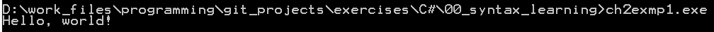
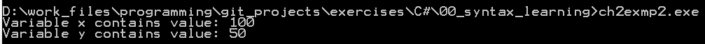
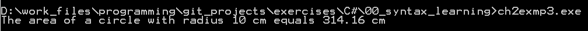
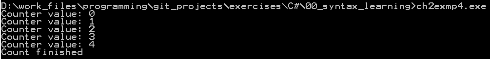
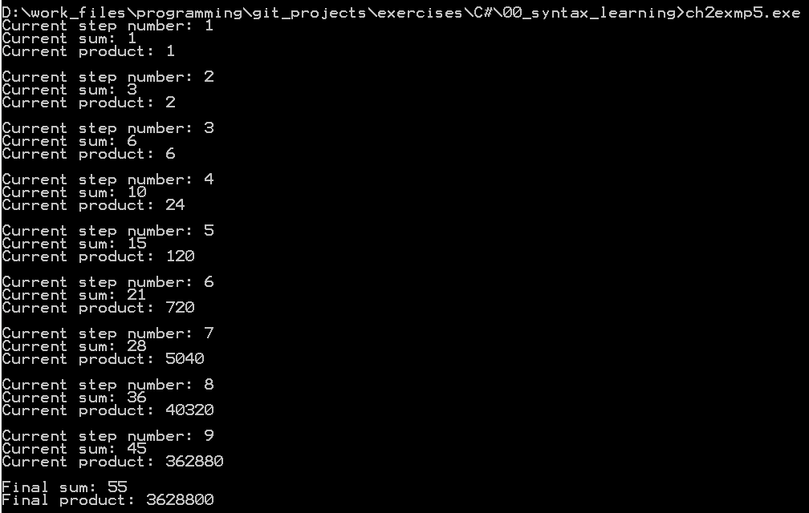

# Конспект главы 2

## Знакомство с концепциями ООП

C# поддерживает принципы ООП программирования, т.к. обладает необходимыми для этого свойствами (инкапсуляция, полиморфизм, наследование).

---

**Инкапсуляция** - создание рабочего черного ящика в виде класса.     
Что подразумевается? - Программы создаются, как набор классов, внутри которых реализуется вся логика (данные, алгоритмы). По сути, классы предоставляют интерфейс, которым можно пользоваться без необходимости знания о его внутреннем устройстве.

---

**Полиморфизм** - один и тот же интерфейс может быть реализован различными способами.

Примеры:
- утка и попугай (объекты класса птица) умеют кричать (используют один интерфейс), но делают это по-разному (разл. реализация);
- руль в машине один, но управление (использование интерфейса) осуществляется через передачу (прямого дейсвия/передачу с усилением/реечную -- разл. реализация).

---

**Наследование** - это когда мы создаем новые классы, используя свойства уже написанных классов.
Польза здесь фактически в том, что не нужно каждый раз переписывать тонны кода.

Пример с яблоком хорош: яблоко -- фрукты с деревьев -- фрукты -- растительная продукты -- продукты питания; у яблока есть все параметры, характерные для экземпляров родительских классов (фрукты и пр.) + несколько уникальных, характерных только для яблок. Чтобы запрограммировать класс "яблоко", нужно лишь взять готовые родительские классы и дополнить их свойствами яблок.

---

### Примеры

 и знакомство с общей структурой программ на C#.

Результат работы программы:


Комментарии по структуре программы:

`class HelloWorld` - объявление вновь определяемого класса Example.

`Main()` - название метода (подпрограммы), с вызова которого начинается любая программа на C#.

`static` - ключевое слово, определяющее метод класса (метода `Main()` в данном случае), который может быть вызван до создания объекта класса, которому данный метод пренадлежит. В данном случае, такая запись необходима, т.к. метод `Main()` вызывается в момент запуска программы.

`void` - ключевое слово, показывающее, что данный метод не возвращает значение.

`using System` - строка задает (ключевое слово using) пространство имен System.

---

#### Использование переменных

Использование целочисленных переменных - [примере 2](ch2exmp2.cs), простой вывод в консоль.

Псевдокод тела программы:
```
создать переменную х, тип integer
создать переменную y, тип integer
присвоить х значение 100
вывести в консоль: "х содержит: <значение х>"
присвоить у значение (х / 2)
вывести в консоль: "у содержит х/2: <значение у>"
```

Результат работы программы:


---

Работа с вещественными числами - , расчет площади круга.

Псевдокод тела программы:
```
создать переменную radius, тип double
создать переменну pi, тип double
создать переменну area, тип double
задать значение радиуса
задать значение числа Пи = 3,1416
рассчитать площадь круга, как radius*radius*pi
вывести в консоль: "Площадь круга с радиусом <radius> равна <area>"
```

Результат работы программы:


---

#### Управляющие операторы if и for

Использование `if`:

```
// single line
if (condition) statement;

// code block
if (condition) {
    statement_1;
    statement_2;
    ...
    statement_N;
}
```

Использование `for`:
```
// single line
for (initialization; condition; iteration) statement;

// code block
for (initialization; condition; iteration) {
    statement;
}
```

---

Псевдокод для [примера 4](ch2exmp4.cs):

```
создать переменную счетчика, integer
в цикле от нуля до 5:
    вывести в консоль текст: "Текущее значение счетчика - <значение счетчика>"
вывести в консоль текст: "Счет окончен"
```

Результат работы программы:


---

Псевдокод для [примера 5](ch2exmp5.cs):
```
создать переменную счетчика, int
создать переменную суммы, int
создать переменную произведения, int
сумма = 0
произведение = 1
в цикле от 1 до 10(включительно):
    сумму увеличить на значение счетчика
    произведение умножить на значение счетчика
    если шаг не последний:
        вывести в консоль текст: "Текущий шаг: <значение>"
        вывести в консоль текст: "Текущая сумма: <значение>"
        вывести в консоль текст: "Текущее произведение:  <значение>"
    на последнем шаге:
        вывести в консоль текст: "Финальная сумма: <значение>"
        вывести в консоль текст: " произведение:  <значение>"
    добавить пустую строку между выводом для каждого шага   
```

Результат работы программы:


---

#### Помнить

Каждая строка кода внутри скобок `{}` должна оканчиваться точкой с запятой (`;`).

Составные элементы оператора просто переносятся на сл. строку в случае длинных строк. Например:
```C#
Console.WriteLine("Avery long output string" +
                  x + y + z +
                  "additional text")
```

Не использовать зарезервированные ключевые слова и контекстные ключевые слова в качестве имен.

C# reserved keywords
<table border="1">
        <tr align=center>
            <td>abstract</td> <td>as</td> <td>base</td> <td>bool</td> <td>break</td>
        </tr>
        <tr align=center>
            <td>byte</td> <td>case</td> <td>catch</td> <td>char</td> <td>checked</td>
        </tr>
        <tr align=center>
            <td>class</td> <td>const</td> <td>continue</td> <td>decimal</td> <td>default</td>
        </tr>
        <tr align=center>
            <td>delegate</td> <td>do</td> <td>double</td> <td>else</td> <td>enum</td>
        </tr>
        <tr align=center>
            <td>event</td> <td>explicit</td> <td>extern</td> <td>false</td> <td>finally</td>
        </tr>
        <tr align=center>
            <td>fixed</td> <td>float</td> <td>for</td> <td>foreach</td> <td>goto</td>
        </tr>
        <tr align=center>
            <td>if</td> <td>implicit</td> <td>in</td> <td>int</td> <td>interface</td>
        </tr>
        <tr align=center>
            <td>internal</td> <td>is</td> <td>lock</td> <td>long</td> <td>namespace</td>
        </tr>
        <tr align=center>
            <td>new</td> <td>null</td> <td>object</td> <td>operator</td> <td>out</td>
        </tr>
        <tr align=center>
            <td>override</td> <td>params</td> <td>private</td> <td>protected</td> <td>public</td>
        </tr>
        <tr align=center>
            <td>readonly</td> <td>ref</td> <td>return</td> <td>sbyte</td> <td>sealed</td>
        </tr>
        <tr align=center>
            <td>short</td> <td>sizeof</td> <td>stackalloc</td> <td>static</td> <td>string</td>
        </tr>
        <tr align=center>
            <td>struct</td> <td>switch</td> <td>this</td> <td>throw</td> <td>true</td>
        </tr>
        <tr align=center>
            <td>try</td> <td>typeof</td> <td>uint</td> <td>ulong</td> <td>unchecked</td>
        </tr>
        <tr align=center>
            <td>unsafe</td> <td>ushort</td> <td>using</td> <td>virtual</td> <td>volatile</td>
        </tr>
        <tr align=center>
            <td>void</td> <td>while</td>
        </tr>
</table>

C# contextual keywords
<table border="1">
        <tr align=center>
            <td>add</td> <td>dynamic</td> <td>from</td> <td>get</td> <td>global</td>
        </tr>
        <tr align=center>
            <td>group</td> <td>into</td> <td>join</td> <td>let</td> <td>orderby</td>
        </tr>
        <tr align=center>
            <td>partial</td> <td>remove</td> <td>select</td> <td>set</td> <td>value</td>
        </tr>
        <tr align=center>
            <td>var</td> <td>where</td> <td>yield</td>
        </tr>
</table>

---
