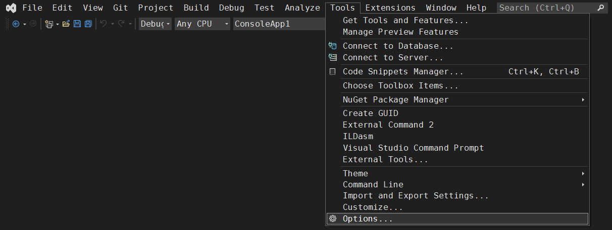
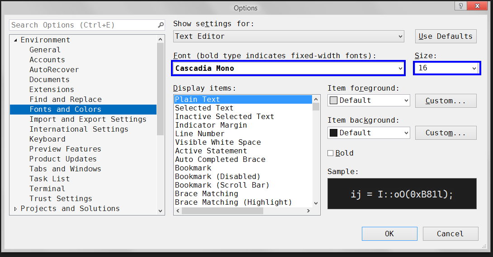
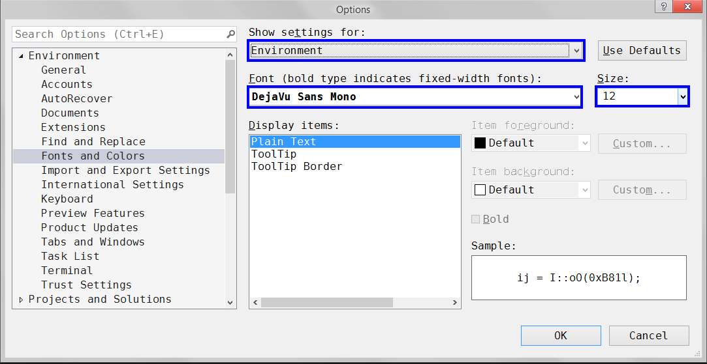
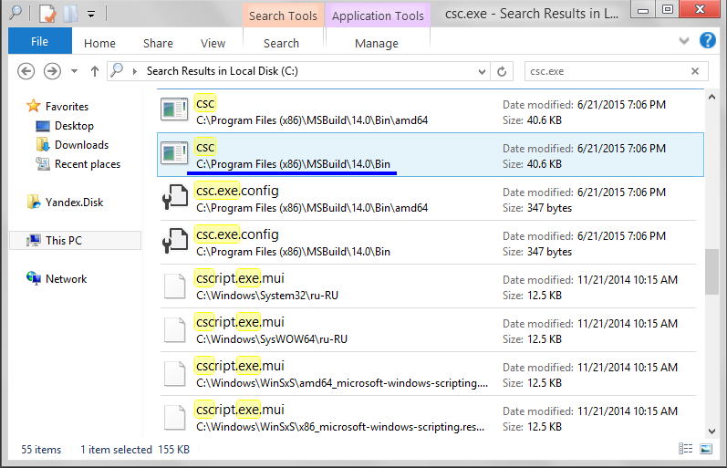
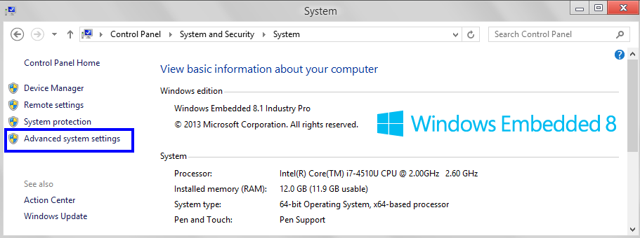
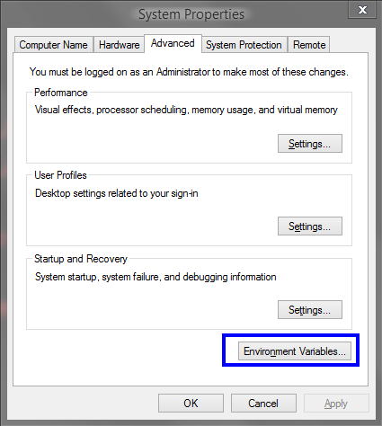
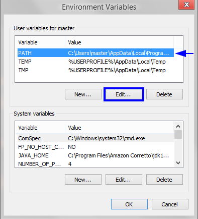
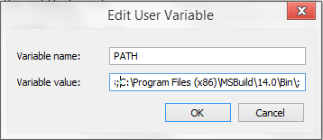
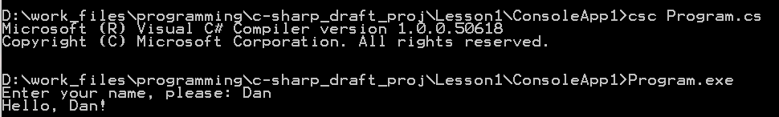

## Построчный анализ кода программы

```c#
class ConsoleApp1
{
    static void Main()
    {
        string name;
        Console.Write("Enter your name, please: ");
        name = Console.ReadLine();
        Console.WriteLine("Hello, " + name + "!");
    }
}
```

---

`class ConsoleApp1` - декларация класса программы в соответствии с объектной ориентацией C#.

`class` является служебным словом.       
`ConsoleApp1` - идентификатор класса программы.


В идентификаторах классов допустимо использование прописных и строчных букв, цифры и знаков подчеркивания. Имя класса не должно начинаться с цифр. Регистр имеет значение ("name" и "Name" - два разных имени).

---

Строчка `static void Main()` задает точку входа в программу. Сразу после запуска программы происходит неявный вызов метода Main(), в результате чего создается единичный объект класса "ConsoleApp1".

Служебное слово `static` позволяет отличить методы класса от методов объектов. Т.е. метод Main() - это метод класса "ConsoleApp1".

`void` обозначает тип данных "отсутствующее значение", т.е. метод `Main()` по завершении работы не возвращает никакого значения.

---

`string name;` – это определение (декларация) строковой переменной с выбранным программистом именем name.

`string` – служебное слово языка C# – обозначение предопределенного типа `System.String` для представления строк.

---

`System.Console.WriteLine("Enter your name, please: ")` - вызов метода `WriteLine()` класса `Console` пространства имен `System`. 

В консоль выводится значение аргумента, полученного методом, а следующий вывод будет осуществляться на новой строке.

Если использовать метод `Console.Write()`, следующий вывод будет выполнен в той же строке.

`System` - название одного из пространств имен .NET Framework

---

`name = System.Console.ReadLine();` - переменной `name` присваивается в качестве значения строка текста, введенного с клавиатуры. Для этого используется метод `ReadLine`

---

`System.Console.WriteLine("Hello, " + name + "!")` выводит результат выражения (конкатенация строк), поступившего в качестве аргумента.

## Пространства имен

Программы на C# получают доступ к окружению, в котором они выполняется, через классы библиотек .NET Framework.

Часто различные библиотеки содержат классы с одинаковыми идентификаторами. Чтобы при вызове таких классов внутри одной программы не возникало конфликтов, используются *пространства имен*.

В одних задачах достаточно использовать уже существующие пространства имен (как упомянутое `System`), в других - приходится создавать новые.

В исходной версии программы использовались *квалифицированные* имена для вызова методов библиотеки `Console`. Т.к. происходит многократное обращение к классу из одного и того же пространства имен, запись можно несколько упростить:
```c#
using System;

class ConsoleApp1
{
    static void Main()
    {
        string name;
        Console.Write("Enter your name, please: ");
        name = Console.ReadLine();
        Console.WriteLine("Hello, " + name + "!");
    }
}
```

## Кодинг и компиляция

Работа с платформой .NET предполагает разработку программ в среде Microsoft Visual Studio (IDE).

IDE у меня пока что вызывает чувство дискомфорта.

Незнакомый интерфейс с большим набором фич. Надо отдельно разбираться и привыкать, тогда как главная задача сейчас - изучить основы C#. Плюс , вызывает недоумение куча дополнительных файлов в директории проекта даже у банального "hello, world".

В общем, не привык работать в IDE, и нужно будет отдельно разобраться :) 

Для начала, подкрутил размер шрифтов интерфейса:
- идем в `Tools > Options > Environment > Fonts and Colors`;
- настраиваем шрифты для Text Editor и Environment (скрины ниже).





Что до кодинга, тут буду тестировать различные подходы. 

Для изучения синтаксиса полезно разбирать и самостоятельно набирать код примеров, так что в старом-добром Vim'е работать буду в любом случае. 

Я по-честному создал проект и позапускал код без дебага по гайдам из учебников.

![[pics/ide_exp.png]]

Тем не  менее, для сравнительно простых примеров, склоняюсь использовать только Vim + консоль:
- набрал код в редакторе;
- скомпилировал с помощью `csc.exe`;
- тут же запустил пример в консоли и сделал скриншоты/GIF'ки для заметки.

#### csc.exe и командная строка

Чтобы запускать компилятор из командной строки, открытой в любой директории, нужно добавить путь к файлу `csc.exe` в переменных окружения.

Расположение файла определяем с через поиск в проводнике:



В панели управления (Control Panel): System and Security > System > Advanced settings



В открывшемся окне выбираем Advanced > Environment Variables.



Переходим к редактированию переменных окружения:



Добавляем в поле путь к директории с файлом `csc.exe`, не забываем добавить точку с запятой в конце:



Теперь можно запускать компилятор в консоли, вызванной в любой директории.



---
