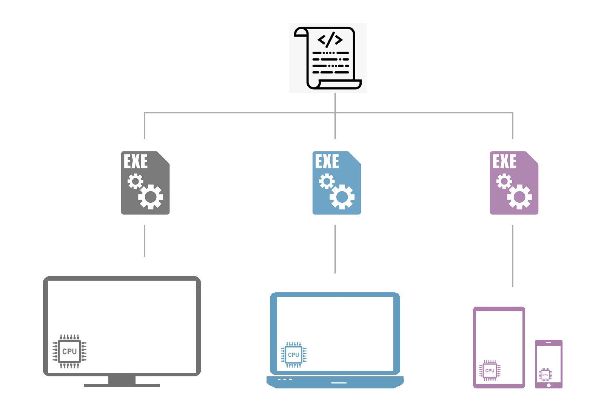
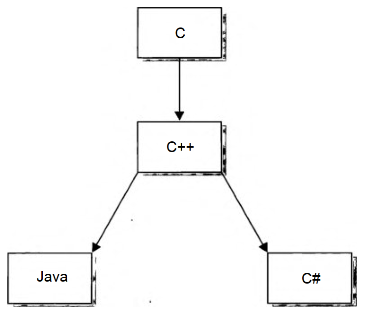
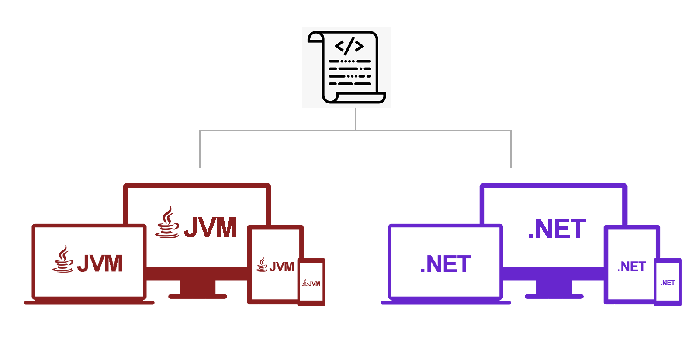

## Как появился C#

До появления интернета традиционном был подход, при котором программы разрабатывались под определенный тип процессора и операционную систему.

С появлением интернета потребовалось запускать одно и то же ПО на разнотипных компьютерах - появилась проблема переносимости программ, в ходе решения которой были созданы Java и C#.

Программы на Java компилируются в промежуточный байт-код, который выполняется [JVM](). JVM устанавливается и запускается в большинстве современных ОС.

В случае с C#, реализован схожий подход - программы запускаются в среде .NET

.NET Framework - платформа, в общем состоящая из двух частей:
- Common Language Runtime (CLR);
- библиотеки классов.

CLR - движок, который обеспечивает работу программ. 

Библиотеки классов предоставляют готовый код для повторного использования. Примечательно, что 
благодаря CLR и библиотекам платформа .NET предоставляет возможность *мультиязыкового программирования*.

О процессе исполнения кода программ на C# - в [заметке](Csh_basics_les1_exec-proc.md).

Основные предпосылки к созданию C#:
- разработка распределенных приложений (решение проблемы переносимости);
- сочетание мощи C/C++ с простотой программирования;
- полная интеграция ЯП с самой популярной ОС (Windows);
- визуальная ориентированность (создание сложных оконных приложений);
- мультиязыковое программирование.

## Объектная ориентированность C#

C# - объектно-ориентированный язык программирования со строгой типизацией.

В объектно-ориентированных языках все является объектом – от констант и переменных базовых типов до данных агрегированных типов любой сложности...

---

В программировании **тип** является первичным понятием. Тип определяет *набор состояний* сущности и *набор функции* (действий, которые могут изменять состояние сущности).

Под сущностью, в частном случае, можно понимать некоторый предмет или объект (для наглядности). Сущностями могут быть также константы, переменные, массивы, структуры и т.д.

С понятием типа тесно связано понятие **переменной**. Под переменной можно понимать пару "обозначение переменной + значение переменной". Для переменной тип вводит совокупность ее возможных значений и набор допустимых операций над этими значениями.

**Объектом** называется совокупность данных (полей), определяющих состояние объекта, и набор функций (методов), обеспечивающих изменение указанных данных (состояния объекта) и доступ к ним.

Существует и альтернативное определение:       
"Объект – это *инкапсуляция* множества операций (методов), доступных для внешних вызовов, и состояния, запоминающего результаты выполнения указанных операций."

Обязательные признаки объекта:
1. различимость;
2. возможность одного объекта находиться в разных состояниях (в разное время);
3. возможность динамического создания объектов
4. «умение» объектов взаимодействовать друг с другом с помощью обменов сообщениями;
5. наличие методов, позволяющих объекту реагировать на сообщения (на внешние для объекта воздействия;
6. инкапсуляция данных внутри объектов.

*Типы* в языке C# введены с помощью *классов* (а также структур, перечислений, интерфейсов, делегатов и массивов).

**Класс** - это механизм, который определяет *структуру* (поля данных) всех однотипных объектов и все методы, относящиеся к данным объектам (их *функциональность*).

Иными словами, класс - это шаблон, по которому создаются объекты.

*В программировании, объект - это переменная типа "класс".*

Для каждого конкретного объекта, класс определяет структуру его состояния и поведение. Состояние объекта задается совокупностью значений его полей. Поведение объекта определяется набором методов, относящихся к объектам данного класса.

Данные, описывающие свойства и методы как класса, так и формируюемых с помощьюе него объектов, называют **членами класса**.      
[Члены в C#](https://docs.microsoft.com/ru-ru/dotnet/csharp/programming-guide/classes-and-structs/members). Если совсем по-простопу, члены класса - это все, что мы указываем при создании класса, когда прогаем.

Внутри объявления каждого класса могут быть размещены:
1. данные класса (статические поля);
2. методы класса (статические методы);
3. данные объектов класса (не статические поля);
4. методы для работы с объектами класса (не статические методы);
5. внутренние классы;
6. дополнительные члены.

В соответствии с объектной ориентацией языка C# - *всякая программа на C# является классом или набором классов.*

---
